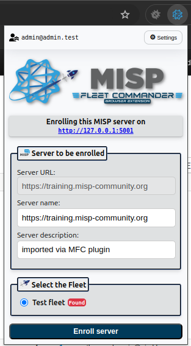

# 🚀 MISP Fleet Commander Browser Extension


**Enroll new MISP servers into Fleet Commander in just one click.**

## 🧭 Overview

Enrolling new MISP servers into [MISP Fleet Commander](https://github.com/mokaddem/MISP-Fleet-Commander) can be a pain — generating API keys, manually copying URLs, and filling in details inside the application.

This browser extension makes it effortless.

With **one click**, the extension grabs the necessary information from the MISP server you're currently browsing and adds it **directly** to your Fleet Commander instance.

## ✅ Why Use This?

- No need to copy/paste API keys or URLs.
- Avoid manual entry errors.
- Speed up fleet expansion.


## 🔧 Installation

> 💡 **Currently available for Chrome only.**

1. Clone or download the [extension repository](https://github.com/mokaddem/MISP-Fleet-Commander-Browser-Extension).
2. Open `chrome://extensions/` in your browser.
3. Enable **Developer mode** (top-right toggle).
4. Click **"Load unpacked"** and select the folder you just downloaded.
5. You should now see the **MISP Fleet Commander** icon in your toolbar.
6. Click on "Details" and then "Extension options"
7. Fill in the URL of your MISP Fleet Commander and your user's API Token

## 🖱️ How to Use

1. Navigate to the MISP server you'd like to enroll.
2. Click the **MISP Fleet Commander** extension icon in your browser.
3. The extension will extract:
   - MISP URL
   - API key (if you're logged in)
4. Confirm the enrollment, and you're done!

## 📷 Screenshots


## 🔒 Security Note

- No data is sent anywhere except between your browser and your own Fleet Commander instance.
- API keys are handled locally.

## 🛠 Development

Want to modify or improve the extension?

- Clone the repo
- Edit the files
- Reload the extension via `chrome://extensions/`

## 💬 Feedback

Spotted a bug or have a suggestion?  
Open an issue or contribute directly via [GitHub](https://github.com/mokaddem/MISP-Fleet-Commander-Browser-Extension).


## ©️ Copyright
```
© 2021–2025 Sami Mokaddem.
© Logo designed by Ysaline Rochez — thank you for the beautiful work!
```
